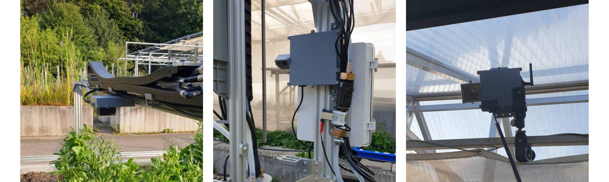

# Hardware
 

__README Author:__ Julian Britten

This document contains a list of all parts used for our Camera System, from Electronics to 3D-Printed parts and other hardware as well as Assembly Instructions.

# Cameras
All cameras consist of a case for a Raspberry Pi and a Camera

## Birdseye View Camera
Mounted to a Greenhouse next to our field.

### Electronics
- Raspberry Pi 4b (1GB)
- Raspberry Pi High Quality Camera with a 180° Fisheye Lens
- 3M USB-C Cable 
- Standard Power Supply for Outlets

### 3D-Printed Parts
- Raspberry Pi Case (Right)
- Cam Module Large

### Other
- Tripod Clamp
- 8x 12mm M3 Screw
- 8x 12mm M3 Nut

## Center View Camera
Mounted in the middle of the horizontal y gantry
### Electronics

- Raspberry Pi 4b (1GB)
- Raspberry Pi High Quality Camera with a 180° Fisheye Lens
- 3M USB-C Cable 
- Custom Farmduino Power Supply

### 3D-Printed Parts
- Raspberry Pi Case (Center) with Lid Camera
- Cam Module Large (Lid Camera)

### Other
- 7x 12mm M3 Screw
- 7x 12mm M3 Nut
- 4x 10mm M5 Screw
- 4x M5 Tee Nut for 20mm Gantry ([3D-Printed Version](https://www.printables.com/de/model/62129-t-nut-m3-m4-m5-for-20mm-profile))

## Side View Camera (Left)
Mounted to the left vertical gantry (the side with the Electronics Box) on the inside.
### Electronics
- Raspberry Pi 4b (1GB)
- Raspberry Pi Camera 1.3
- 30cm USB-C Cable
- Custom Farmduino Power Supply

### 3D-Printed Parts
- Raspberry Pi Case (Left)
- Cam Module

### Other
- 8x 12mm M3 Screw
- 8x 12mm M3 Nut
- 3x 10mm M5 Screw
- 3x M5 Tee Nut for 20mm Gantry ([3D-Printed Version](https://www.printables.com/de/model/62129-t-nut-m3-m4-m5-for-20mm-profile))

## Side View Camera (Right)
Mounted to the right vertical gantry (opposite of the Electronics Box) on the outside \
__Note__: Was printed and tested but is no longer in use and replaced with __Center View Camera__

### Electronics

- Raspberry Pi 3b (1GB)
- Raspberry Pi Camera 1.3
- 5m Micro-USB Cable (3.5m needed)
- Custom Farmduino Power Supply

### 3D-Printed Parts
- Raspberry Pi Case (Right)
- Cam Module

### Other
- 8x 12mm M3 Screw
- 8x 12mm M3 Nut
- 6x 10mm M5 Screw
- 6x M5 Tee Nut for 20mm Gantry ([3D-Printed Version](https://www.printables.com/de/model/62129-t-nut-m3-m4-m5-for-20mm-profile))

## Camera Assembly Instructions
Generally, all Raspberry Pi & Camera cases are built the same. In this assembly manual, the  left camera case is used. See the [3D Printed Parts](#3d-printed-parts) section for a list of materials needed for the specific case you intend to assemble.

 \
From the top left: 5mm acrylic plastic sheet, Raspberry Pi 4b, Pi Case Left - Base, Sealings, RPI Camera, Pi Case Lid, Pi Camera Lid, Pi Camera Case, M5 Screws & Tee Nuts, M3 Screws & Nuts.

In addition to the parts in the picture, some assembly tools are required including Screwdrivers and a hot glue gun.

1. Put the Case Sealing & Raspberry Pi into the Case
2. Put the Camera into it's case and guide the camera cable through the hole into the Pi case. Don't forget to put the camera sealing ring on it.
3. Click the Camera Case into the Raspberry Pi Case. They are designed to be able to be rotated.

4. Using hot glue, glue a piece of the 5mm acrylic sheet to the camera lid.
5. Fit the USB Cable in between the USB Cable sealings.
6. Pressing them on top of each other, push the sealings with the cable in between through the power plug hole at the bottom. Consider cutting off parts of the sealings on the back that have trouble pushing them through the hole

7. Put the M3 screws into the lid holes and the M5 screws into the gantry screw holes.
8. Put the M3 nuts on the back and the M5 Tee Nuts on the M5 screws
9. Mount the case to the gantry.

# Custom Farmduino Power Supply
Supplying power via USB becomes difficult starting at 5m. Because the vertical gantry cameras move with the bot, their cables would have to be inside the cable carriers as well and thus be too long for stable power supply. To avoid this, we make use of the `FarmBot's` spare `24VDC` peripherals on the [Farmduino Circuit Board](https://genesis.farm.bot/v1.6/assembly/electronics) by converting it to `5VDC`.

### Electronics
- XL4015 DC-DC Step Down Converter
- Spare cables
- 2 Pin Molex connector (compare with [fardmuino specs](https://genesis.farm.bot/v1.6/bom/electronics-and-wiring/farmduino) for Peripheral 4 and 5)
- USB-C/USB-A Breakout Board (depending on your cable and Raspberry Pi)

#### 3D-Printed Parts
- XL4015  Case by [suside](https://www.thingiverse.com/thing:6010179)
- XL4015 Case by [Red Haniwa](https://www.printables.com/model/428490-xl4015-cc-cv-buck-converter-case)

Depending on the version of your XL4015 Converter, you may need to use a different model

## Assembly Instructions
__Notes:__ Some basic knowledge about electrical engineering is required along with some additional equipment such as a soldering iron, Lab Power Supply, Multimeter, etc.

1. Using a Lab DC Power Supply, connect it to your `XL4015 DC-DC Step Down Converter` and provide it with `24V` and some low current
2. Measure Voltage on the other end using a Multimeter. 
3. Change the Output Voltage of your `XL4015` to `5-5.2V`. In our case, this is achieved by turning the small screw on it clockwise. This may differ from model to model. 
    - If you are not powering a Raspberry Pi 3b/4b, make sure the Voltage matches the device you intend to use!
    -  (Optional): Connect the output to your 5V and GND pin on the GPIO header of your Pi to test if it turns on.
4. Connect the `5V` & `GND` Output to `VBUS` & `GND` of your `USB Breakout Board`, e.g. via a ~5cm cable
5. Connect a ~5cm cable with a `2Pin Molex Connector` that fits your `FarmBot's` [Farmduino Circuit Board](https://genesis.farm.bot/v1.6/assembly/electronics) to your XL4015.
6. Put the XL4015 in it's 3d-Printed case. While not required, we recommend a case to avoid accidental changes on the Output dial
7. Plug the assembled Power Supply into your Farmduino's spare Peripheral Slot 4/5 (Make sure to match `24V` and `GND!`)
8. Plug in your Raspberry Pi.
9. In your FarmBot Web App, turn on the corresponding Peripheral Pin. Only then the circuit will receive power!
    - If your FarmBot loses power or is E-Stopped, you will need to re-enable those pins.
10. Done! You can now power an extra Raspberry Pi via the Farmduino Board!

# 3D Printing

All models used can be found in the `3D Printed Parts` directory. 

The designs of these parts may be improved upon. For example, the walls were designed way thicker than necessary. 

All custom parts were designed using [Onshape](https://www.onshape.com/). We intend to make these designs available for modification once our paper is accepted.

## Printing Instructions
All instructions apply to the custom parts created for the FarmBot
### Sealings
- Printer: `Ultimaker Original`
- Nozzle: `0.4mm`
- Material: `TPU 95A`
- Layer Height: `0.2mm`
- Infill: `100%`
- Supports: `No`
- Brim: `yes`

### Other 
- Printer: `Bambu Lab X1 Carbon`
- Nozzle: `0.4mm`
- Material: `Bambu ASA`
- Layer Height: `0.2mm`
- Infill: `20%`
- Infill Pattern: `Grid`
- Supports: `Yes`
- Brim: `yes`
- Other: `4 Wall loops`

## Raspberry Pi Case (Right)
### Parts
- Raspberry Pi Case Right - Base
- Raspberry Pi Case - Lid
- Lid Sealing
- 2x USB Cable Sealing

## Raspberry Pi Case (Left)
### Parts
- Raspberry Pi Case Left - Base
- Raspberry Pi Case - Lid
- Lid Sealing
- 2x USB Cable Sealing

## Raspberry Pi Case (Center) 
Note: Unused in our setup
### Parts
#### Side Camera
- Raspberry Pi Case Center - Base
- Raspberry Pi Case - Lid
- Lid Sealing
- 2x USB Cable Sealing
#### Lid Camera
- Raspberry Pi Case Center - Base (Lid Camera)
- Raspberry Pi Case - Lid (Center) (Lid Camera)
- Lid Sealing
- 2x USB Cable Sealing

Note: __Requires the Cam Module Large Lid Parts__

## Cam Module
Note: Requires a ~5mm clear plastic sheet, e.g. acrylic as a lens cover and hot glue to assemble

__When printing this part for the LEFT camera, the Base needs to be mirrored along one axis.__
### Parts
- Cam Module - Base
- Cam Module - Connector Sealing
- Cam Module - Cover

## Cam Module Large

### Parts
#### Side

- Cam Module Large - Base
- Cam Module Large - Connector Sealing
- Cam Module Large - Cover
- Cam Module Large - Lid Sealing

Note: Requires a ~5mm clear plastic sheet, e.g. acrylic and hot glue to assemble
## Lid
- Cam Module Large - Bottom
- Cam Module Large - Top 

Notes: 
- Requires a ~5mm clear plastic sheet (5.15x5.15cm), e.g. acrylic and hot glue to assemble
- __Requires the Raspberry Pi Case (Center) Lid Camera Pi Case__
