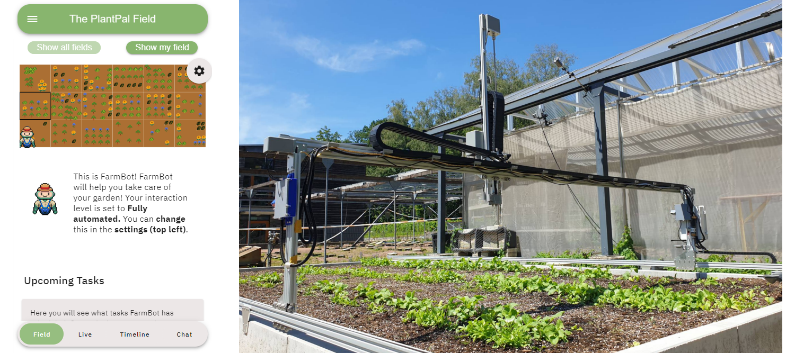

# PlantPal: Leveraging Precision Agriculture Robots to Facilitate Remote Engagement in Urban Gardening



## Abstract
Urban gardening is widely recognized for its numerous health and environmental benefits. However, the lack of suitable
garden spaces, demanding daily schedules, and limited gardening expertise present major roadblocks for citizens looking
to engage in urban gardening. While prior research has explored smart home solutions to support urban gardeners, these
approaches currently do not address these practical barriers. In this paper, we present `PlantPal`, a system that enables the
cultivation of garden spaces irrespective of one’s location, expertise level, or time constraints. `PlantPal` enables the shared
operation of a precision agriculture robot (PAR) that is equipped with garden tools and a multi-camera system. Insights from
a 3-week deployment (N=18) indicate that `PlantPal` facilitated the integration of gardening tasks into daily routines, fostered a
sense of connection with one’s field, and provided an engaging experience despite the remote setting. We contribute design
considerations for future robot-assisted urban gardening concepts.


For more information on the project, please refer to our [full paper](https://doi.org/10.1145/3706598.3713180). 

## Authors
[Albin Zeqiri](mailto:albin.zeqiri@uni-ulm.de), [Julian Britten](mailto:julian.britten@uni-ulm.de), [Clara Schramm](clara.schramm@uni-ulm.de), [Pascal Jansen](mailto:pascal.jansen@uni-ulm.de), [Michael Rietzler](michael.rietzler@uni-ulm.de), [Enrico Rukzio](enrico.rukzio@uni-ulm.de)


## Content
Each directory contains its own README with more detailed information on its content.


### [FarmBot](./FarmBot/README.md)
The [FarmBot](https://farm.bot/) is a 100% open-source gardening robot capable of taking care of most gardening tasks.

The `FarmBot` directory contains information about custom sequences and routines, settings, general modifications (e.g., 3d printed parts) made to the device that are either required or recommended for the FarmBot to be ready to used with the FarmBot Web App. For more information, please refer to the [README file](./FarmBot/README.md)


### [PlantPal Web App](./WebApp/README.md)
Written using `Nuxt` & `VueJS`, our Web App allows multiple users to control and manage the use of the farm bot. We built our own app from scratch to have full control over the features we offer to users/study participants while keeping the original [Farmbot Web App](https://my.farm.bot) untouched.
This way, we can control the farmbot independently from our own custom Web App, which can be enabled/disabled at will without compromising the FarmBot's functionalities.

For more information on the app, refer to the [README file](./WebApp/README.md) in the WebApp directory.

### [Camera](./Camera/README.md)
FarmBot, by default, only supports one camera - the one mounted to its arm.
To offer more viewing angles in our app, we built a client-server infrastructure using [MediaMTX](https://github.com/bluenviron/mediamtx) and [FFmpeg](https://www.ffmpeg.org/). This setup allows us to publish and subscribe to as many camera feeds as we want. For more information, refer to the specific [README file](./Camera/README.md).

For information about the custom 3D printed parts we designed & built for mounting `Raspberry Pi Cameras` to the `Farmbot`, please refer to the [Hardware README file](./Camera/Hardware.md).

## Citation

If you use this work in your research, please cite it using the following information:

#### BibTeX
```bibtex
@inproceedings{10.1145/3706598.3713180,
  title        = {PlantPal: Leveraging Precision Agriculture Robots to Facilitate Remote Engagement in Urban Gardening},
  author       = {Zeqiri, Albin and Britten, Julian and Schramm, Clara and Jansen, Pascal and Rietzler, Michael and Rukzio, Enrico},
  year         = {2025},
  booktitle    = {Proceedings of the 2025 CHI Conference on Human Factors in Computing Systems},
  location     = {Yokohama, Japan},
  publisher    = {Association for Computing Machinery},
  address      = {New York, NY, USA},
  series       = {CHI '25},
  doi          = {10.1145/3706598.3713180},
  isbn         = {979-8-4007-1394-1/25/04},
  url          = {https://doi.org/10.1145/3706598.3713180},
  numpages     = 32
}
```
