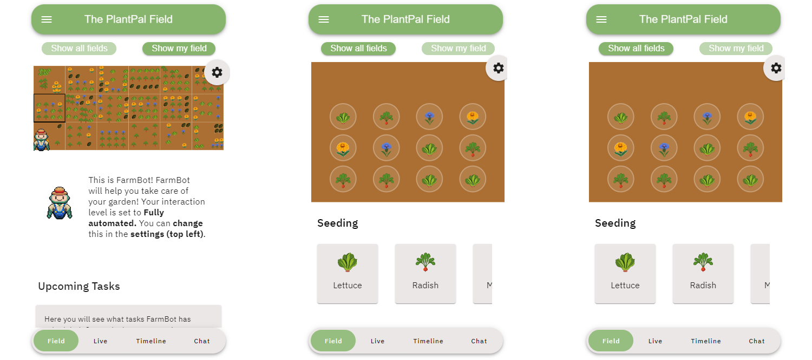
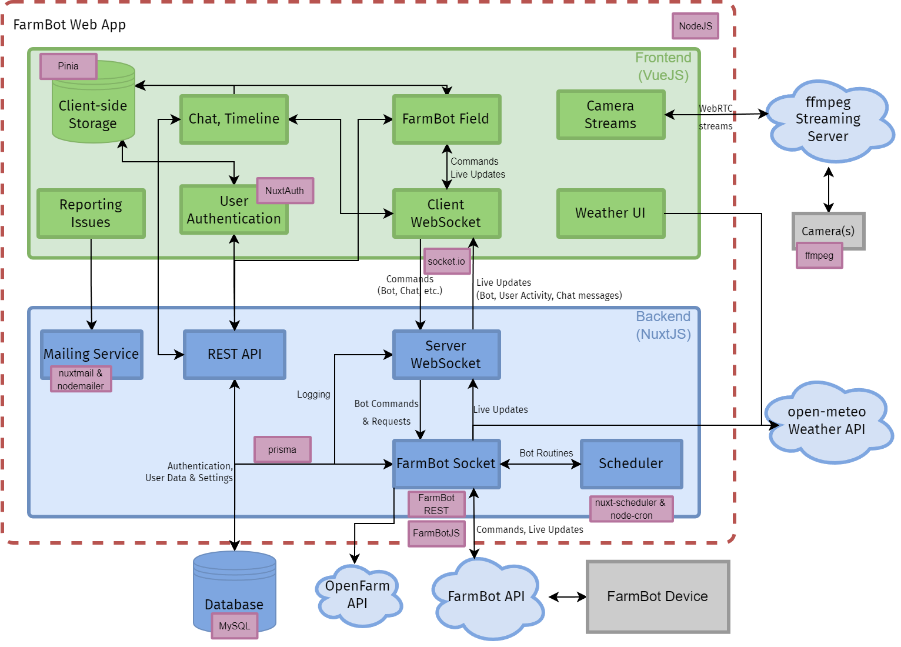

# PlantPal - Collaborative FarmBot Web App 

__Developers:__ Julian Britten, Clara Schramm, Albin Zeqiri

__README Author:__ Julian Britten


## Features
### Global Field View
- Gives an overview over the entire garden with photo overlay
- FarmBot info prompt, where the current status of the robot & other information is displayed
- A queue showcasing scheduled tasks by users
- A weather card showing weather, temperature
### Personal Field View
- Overview over own section of the garden with photo overlay and growth timelapse
- Simplified process of seeding, watering, & weeding.

### Live View
- Access multiple camera streams to see the robot from multiple angles

### Timeline
- Offers users information about previously executed tasks


### Chat
- Allows users to communicate with each other
### Settings
- Modifying 'Level of Automation' that modifies level of control over the robot

## Setup
### Requirements
- Requires [NodeJS](https://nodejs.org/en)
- Requires npx: Run `npm install -g npx`

### Launching 
#### Development
- Navigate to `cd FarmBotApp`
- Run `npm install` (after pulling to ensure all libraries required are installed)
- (On first launch or after changes to the database): `npx prisma migrate dev`
- `AUTH_ORIGIN` in the `.env` file needs to be set to `localhost:3000`
- Launch App via `npm run dev -- -o`

### Building
- In the `.env` file, set the `AUTH_ORIGIN` to the IP of the server
- Run `npx nuxi build`. It will afterwards show you a launch command
- Run the deployed app using `node .output/server/index.mjs`
- __IMPORTANT:__ Run the build command on the system you want to deploy the web app, as node deployment may work differently depending on hardware & operating system

### Deploying on Linux
1. Run `which node` to get the full path of your node installation (of course node needs to be installed)
2. Create a cronjob with `crontab -e`
3. Add a command that looks something like this:
```
@reboot cd /home/ubuntu/farmbot-collaborative/WebApp/FarmBotApp/ && /full/path/to/node .output/server/index.mjs
```
Individual paths may vary.


## Architecture

A brief overview over the architecture of our Web App

### Tech-Stack
- Framework: [Nuxt3](https://nuxt.com) with [VueJS](https://vuejs.org)
- Websockets: [socket.io](https://socket.io/), store-middleware based client-server infrastructure based on [this](https://github.com/adityar15/nuxt3socket/blob/master/server/middleware/socket.ts)
- FarmBot: [REST](https://developer.farm.bot/v15/docs/web-app/rest-api) & [FarmbotJS](https://developer.farm.bot/v15/docs/farmbot-js)
- Database: [Prisma](https://www.prisma.io/) with a [MySQL](https://mysql.com) database(, read [more](./Database.md) )
- Authentication/Authorization: [Nuxt-Auth](https://auth.nuxtjs.org/), code adapted from [this](https://github.com/ismaelcmajada/Nuxt3-Vuetify3-Prisma-Auth) example
- Weather API: [Open-Meteo](https://open-meteo.com/)
- Client-side data storage: [Pinia](https://pinia.vuejs.org/)
- Server-side scheduled events: [Nuxt-Scheduler](https://github.com/jurassicjs/nuxt-scheduler)
- Reporting Issues: [Nuxt-Mail](https://nuxt.com/modules/nuxt-mail)
- Image Processing: [sharp](https://sharp.pixelplumbing.com/)

For a full list of used packages, run `npm ls`

### Styling
In addition to standard css and Vue components, we are using [Vuetify](https://vuetifyjs.com/en/), a library with lots of pre-created components for easier and faster development. Many components [here](https://vuetifyjs.com/en/components/all/#containment).
- [Material Design Icons](https://pictogrammers.com/library/mdi/) for general UI
- [Open Crop Icons](https://github.com/openfarmcc/open-crop-icons) for plants (Note: Adjustments made to package.json to import the icons folder as well)

### Pages
- Chat: Layout inspired by and updated to Nuxt3 from [here](https://www.codeply.com/p/2n5OiAvWd9)


## Implementation Notes
### Framework
- For VueJS, we want to use the Composition API as it is more flexible. When reading the VueJS docs, make sure the API preference is set to "Composition"

### Open Crop Icons
Due to an _unknown_ issue, the [Open Crop Icons](https://github.com/openfarmcc/open-crop-icons) package does not import the icons folder. This issue could be resolved by forking the repository and removing the "files" property from the `package.json` file

To use a Open Crop Icon inside the vue context, e.g. a `<v-item>`, refer to the `OpenCropItem` component and it's documentation.

For importing the images in general, either use
`import  cropIcons  from 'open-crop-icons';` to import all icons at once, or import individual plants using `import { acornSquash } from 'open-crop-icons'`. In either case, you are going to end up with paths to the icon which you can then use in an image file.

Note: In the build versions, we currently don't use Open Crop Icons as it causes an issue when building.

### Executing FarmBot Sequences
Because `FarmBot`only allows passing one variable & also has a character limit on lua routines, we define most of routines directly in this project and pass it as a string (this has no character limit). Refer to the `/server/utils/lua` directory for these.

FarmBot sequences are added as tasks to the `FarmBotTaskManager` plugin. It checks whether the FarmBot is currently busy, and if it isn't, it is going to execute the next task in queue. There is a callback, however we found this to be unreliable at times and opted for this method.

To make sure sequences work correctly with our queue, they need to update their Job Progress and end up with `100%` Percentage at the end. Only if all jobs are at 100%, the queue will continue. This means that if you add a new sequence that should hold up the queue if it fails (to protect the robot), don't let it reach `100%`. This will block the queue and give you time to fix the issue. To clear the still existing job, refer to the Clear Job Sequence found in the [FarmBot README](../FarmBot/README.md#sequences)


If the bot should continue to operate even upon failure, change the final status of the job progress to `Failed`. The app will then add the job as failed to the timeline.


### Database
The Farmbot Web App uses a MYSQL database and accesses it via PRISMA.

## Working with the Database

For a basic understanding, we suggest reading into [this](https://masteringnuxt.com/blog/setting-up-prisma-with-supabase) tutorial series as well as the [PRISMA docs](https://www.prisma.io/docs/orm/overview/prisma-in-your-stack/fullstack).

### TL;DR
- Anything we want to put into and read from the library is defined in the `prisma/schema.prisma` file
    - Changes require running `prisma migrate dev/deploy`, it may lead to data loss
- Additionally, you can fill the database with dummy data by adding to the `prisma/seed.js` script and running `prisma migrate reset`. This will ALWAYS remove all existing data from the database
- If you want to test if data is actually being stored in the database, you can run `(npx) prisma studio`. This will launch its own web interface where you can see all the data currently in your database according to your schema. You can also modify the database this way


### Logging
This section is specifically about logging user activities - which we deem relevant to the analysis of the study. Our "logger" is specific function `logAction(activity: string, data: string)` in the `clientSocketStore`. It sends a message with information to the backend `socket.middleware` which stores it in an array. This array is pushed into the database as soon as the user disconnects in an effort to reduce traffic for the user.

To use it, the `clientSocketStore` must be used on the page - On most pages that is already the case:
```ts
import { useConnectionStore } from '~/stores/clientSocketStore';

const ConnectionStore = useConnectionStore();
...
function anActionIWantToLog() {
    ...
    ConnectionStore.logAction("Name of the Activity", {additonalData: "Additional data JSON"});
    ...
}
```
#### Logging Locations
| File | Logged Action |
| ---- | ---- |
| MainComponent | fieldState, currentPage |
| SettingsComponent | interactionLevel |
| ReportIssueComponent | issueReported |
| clientSocketStore | sendChatMessage |
| SeedingSlideGroup | seeding, seedingSimple |
| MaintenanceSlideGroup | waterSelected, waterAll, weedSimple, weedHack, weedCut |

### IDE
- Consider using VSCode with the following extensions: 
    - Vue Language Features (Volar)
    - Nuxtr
    - Prisma
### Learning Resources 
- Vue Video Tutorial Series [Link](https://www.youtube.com/watch?v=BZwn47RPiAM&list=PL3VM-unCzF8jX-GoazLPcbi7M0wJux8F-)
- Vue Documentation [Link](https://vuejs.org/guide/introduction.html)
- Nuxt Documentation [Link](https://nuxt.com/docs/getting-started/installation)


